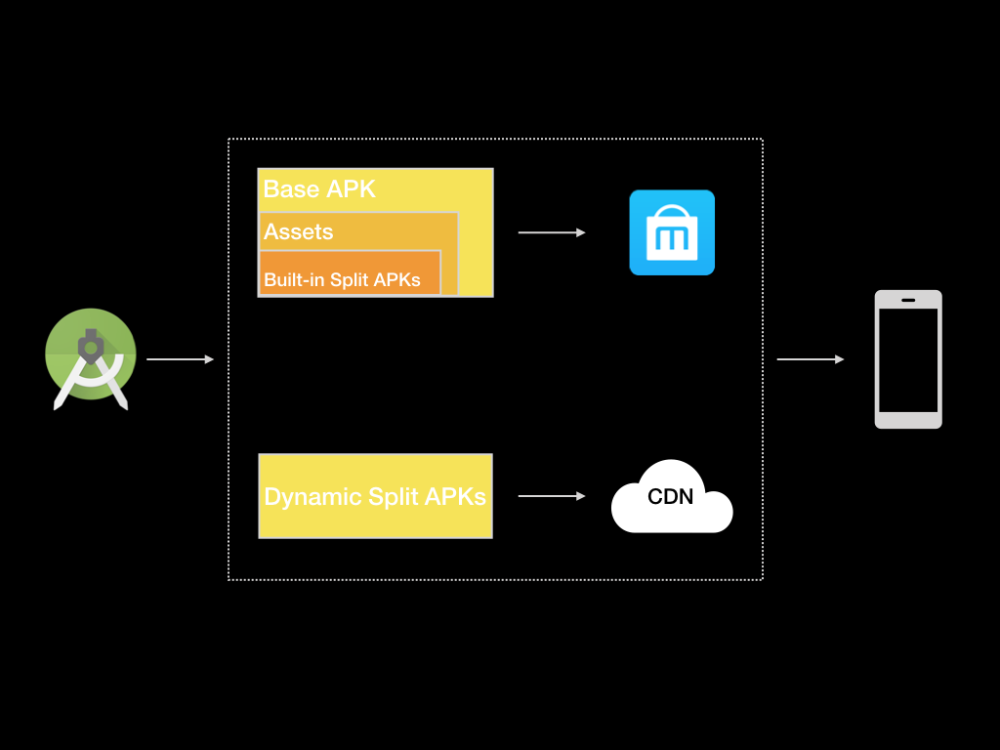

# Qigsaw


Qigsaw是一套基于[Android App Bundles](https://developer.android.com/guide/app-bundle/)实现的Android动态组件化方案，它无需应用重新安装即可动态分发插件。



## 开始

在你项目根目录下的`build.gradle`文件中增加qigsaw-gradle-plugin作为依赖。

```
buildscript {
    dependencies {
        classpath 'com.iqiyi.android.qigsaw:gradle-plugin:1.3.3'
    }
}
```

接着在`app/build.gradle`文件中应用如下所示插件和依赖。

```
dependencies {
    //qigsaw core lib
    implementation "com.iqiyi.android.qigsaw:splitcore:1.3.3"
}
...
...
apply plugin: 'com.iqiyi.qigsaw.application'
```

最后在`dynamicfeature/build.gradle`文件中应用如下所示插件。

```
apply plugin: 'com.iqiyi.qigsaw.dynamicfeature'
```

考虑到每个应用程序都有自己的下载器，qigsaw只提供下载接口，交由接入方实现。从[SampleDownloader](./app/src/main/java/com/iqiyi/qigsaw/sample/downloader/SampleDownloader.java)示例中了解更多信息。

Qigsaw-gradle-plugin会在编译期间上传需要动态加载的split APK，因此您必须实现SplitApkUploader才能将split APK上传到您的CND服务器。从[SampleSplitApkUploader](./qigsaw-android-sample/buildSrc/src/main/groovy/com/iqiyi/qigsaw/buildtool/gradle/sample/upload/SampleSplitApkUploader.groovy)示例中了解更多信息。

如何安装qigsaw？从[QigsawApplication](./app/src/main/java/com/iqiyi/qigsaw/sample/QigsawApplication.java)示例中了解更多信息。

关于proguard，我们通过qigsaw-gradle-plugin自动生成proguard配置。

关于multiDex，从示例[multidexkeep.pro](./app/multidexkeep.pro)中了解更多信息。

有关更多qigsaw配置，从示例[app/build.gradle](./app/build.gradle)中了解更多信息。

如何安装split APK？Qigsaw提供了与[Play Core Library](https://developer.android.com/guide/app-bundle/playcore#monitor_requests)相同的API ，因此您可以参阅Google开发者文档来进行安装。

如何构建base APK和split APK？在开发过程中，您可以运行`qigsawAssembleDebug`task或者直接点击Android Studio的`Run`按钮进行构建。发布时，使用`qigsawAssembleRelease`task构建。

Qigsaw支持插件热修复，具体操作可以参考更新指南[Qigsaw插件更新指南](./SPLIT_UPDATE_GUIDE.zh.CN.md)。

## 已知问题

1. 插件无法更新AndroidManifest.xml，例如新增四大组件等。
2. 无法动态更新base APK。
3. 插件不支持增量更新。
4. 不支持低于4.0的Android系统版本。
5. 其他更多已知问题请参考[Android App Bundles](https://developer.android.com/guide/app-bundle/#known_issues)。

## 功能拓展

Qigsaw提供一些Android App Bundle中未支持的功能。

1. 支持初始化插件Application，创建插件Application实例并调用`Application#attachBaseContext`和`Application#onCreate`方法。

2. 支持动态加载插件ContentProvider。

## 支持

1. 从qigsaw-sample中可了解更多信息。

2. 查看[Wiki](https://github.com/iqiyi/Qigsaw/wiki)或FAQ以获取帮助。

3. 邮箱联系，[kissonchen@qiyi.com](mailto:kissonchen@qiyi.com)。

4. 加入QQ群了解最新信息。
   

## 贡献

更多关于贡献、issues或PR等信息，请您查阅[Qigsaw贡献指南](https://github.com/iqiyi/Qigsaw/blob/master/CONTRIBUTING.MD)。

## 许可

Qigsaw授权条约为MIT license，请您查阅[LICENSE](https://github.com/iqiyi/Qigsaw/blob/master/LICENSE)以获取更多信息。


